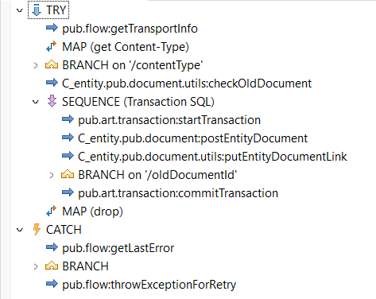

> BIMONT Maxime

> E-mothep

> Intégrateur webmethods

# Semaine du 26 février au 1 mars

## Ce que j'ai fait

Retour en entreprise après 2 mois d'absence. Plusieurs choses ont changé dans mon projet, notamment sur le stockage de mes données qui ont été migrées vers une base de données MySQL. Mon application angular a été mise sur un dépôt GIT et configuré pour travailler en toute autonomie et faciliter la mise en production prévue à l'avenir. Le dossier webmethods du projet à été déplacé dans le workspace de tous les projets interne de l'entreprise et à besoin d'être restructuré pour une meilleur organisation et sécurité. Ma mission était donc de reconnecter les adapters, les flows et les API entre-eux. Lundi en début d'après-midi, j'ai un eu point avec mon MA et mon chef d'équipe pour faire un point sur mon évaluation sur la moitié de la période de mon alternance et de rappeler les objectifs et deadlines du projet. Sur ce dernier, plusieurs améliorations ont été présentées pour une meilleur ergonomie et différents retours fait durant mon absence. J'ai fini la journée en restructurant le dossier du projet dans webmethods.

J'ai commencé par reconnecter tous les adapters au flows services et ces derniers au API. Ensuite j'ai changé les url obsolètes des API dans les appels fetch ou http côté front. J'ai continué en modifiant la partie de front de sorte à ravoir le même rendu qu'à l'origine. Il m'a fallu supprimé certains appel d'API et revoir l'envoi de données pour d'autres. Le dernier point était les fichiers joints. Ces derniers n'ayant plus d'appel API à eux même côté back ont été rattachés dans la création de note. 

Ensuite il m'a fallut modifier mes flows services pour prendre en compte les apports effectuer côté front. J'ai donc insérer dans la création de la note, l'insertion des fichiers dans la db et dans le serveur. A la fin de cette semaine je pouvais donc insérer et récupérer des fichiers lors de la création et visualiation de note. 

## Ce que j'ai appris

Durant cette semaine je n'ai pas aprris de nouvelles choses, j'ai surtout eu un rappel de ce que j'avais vu et appris les semaines précédentes que ca soit côté front ou back.

## Ce que j'ai ressenti

J'ai heurté sur un problème de multi-origine lors d'appel de plusieurs url en simultané ( 1 pour l'API et 1 pour l'application ). Pour palier à ce problème il m'a fallut configuer le serveur webmethods en ajoutant certains paramètres dans les `Settings > Extends`. 

J'ai eu beaucoup de mal avec le type que devait prendre mes fichiers côté front pour que le back puisse les récupérer avec toutes les données qu'ils comportaient. Après d'innombrable essaie pour envoyer la liste de fichiers vers le back j'ai trouvé le moyen, assez simple, de le faire. Il suffisait d'encoder les fichiers en base64 et de les envoyer tel quel vers le back.

Un problème est survenue lorsque je souhaitais récupérer mes fichiers depuis le serveur. Le type de retour qui devait être un InputStream était en fait un string, donc inutilisable pour mon code. Le problème c'est révélé être que si le nom du fichier comportait un espace, la méthode `client.sftp:get` n'interprétait pas correctement ce charactère et envoyer un message d'erreur

Une des difficultés à été mon manque de compétence en Angular pour travailler rapidement.

## Ce qui est prévu pour la semaine prochaine 

Dans 2 semaines, j'ajouterais :
- la visualisation côté front 
- l'ajout des fichiers lors de l'insertion de commentaire dans les notes.
- le téléchargement et la lecture des fichiers

# Semaine du 11 mars au 15 mars

## Ce que j'ai fait

J'ai commencé cette semaine en apportant des modifications sur les documents type tel que 'comments' ou 'files' pour avoir les mêmes noms de paramètres entre le back et le front. J'ai réussi à obtenir un résultat satisfaisant avec les fichiers insérer dans les commentaires et les notes et non uniquement regroupés dans la note. 

J'ai été demandé des conseils à Aymeric Henouille, un membre de l'équipe Front pour m'aider sur certains aspect du projet côté front. Je savais déjà que la partie front présentait quelques problèmes puisque j'ai récupéré un projet déjà existant et que j'ai peu de compétence en angular. J'ai pu de ce fait améliorer certains points en therme d'optimisation. 

J'ai par la suite, améliorer mes flows webmethods car je me suis rendu compte que mes appels API prenaient du temps (beaucoup trop de temps). Avec mon MA on a donc observé quels flows étaient utilisés dans d'autres et refractor certains pour optimiser le temps d'appel API. 

Sur un conseil donné par un membre de l'équipe front, j'ai voulu mettre à jour les dépendances de mon projet côté front comme par exemple `@angular/core` et `@angular/cli`. Mais cette action à amené plus de problèmes qu'autre chose.

Cette semaine à plus été sujet à des améliorations de l'existant et des conseils côté front pour améliorer le projet dans sa globalité

## Ce que j'ai appris

J'ai fini par faire des exercices sur le type Observable et sur la librairie RJSX d'angular donné par Aymeric Henouille. Cela m'a beaucoup aidé pour améliorer mes appels APi, refractor mes fonctions et nettoyer un peu mon code.

Je me suis beaucoup améliorer dans l'utilisation de GIT avec la création de branche pour chaque problème ou ajout de features et les merges sur la branche principale. Cela me permet maintenant de limiter les erreurs et de ne pas impacter la solution viable du projet.

## Ce que j'ai ressenti

Un problème est apparu lors du téléchargement du fichier, ce dernier était mal encodé et donc illisible. Après plusieurs tests j'ai trouvé que l'erreur survient entre le moment ou je récupère mon fichier depuis le serveur distant et lorsque je l'envoi vers le front via WebMethods. Le problème venait du fait que je ne précisais pas le type d'encodage `utf-8` lorsque j'encodais ou décodais mes fichiers dans webmethods.

Le problème qu'à entrainer la mise à jour des dépendances est que d'autres dépendances n'héritaient plus de certaines et que donc certaines méthodes dans mon projet ne fonctionnait plus entraînant une incapacité à compiler mon projet. Pour résoudre ce problème j'ai récupérer une backUp qui datait de décembre et apportait les modificatios nécessaires pour revenir un résultat optimal du projet.

## Ce qui est prévu pour la semaine prochaine 

Pour la semaine prochaine, je compte essayer de faire : 
- Un nettoyage côté front 
- Continuer l'optimisation des flows services
- Régler quelques soucis mineur d'affichage

# Semaine du 18 mars au 22 mars

## Ce que j'ai fait

L'objectif de cette semaine était d'améliorer ce qui était déjà sur le projet et non d'ajouter de nouvelles fonctionnalités dans l'idée de réaliser une première mise en production à la fin de la semaine suivante. J'ai commencé par optimiser mes flows services côté Back en essayant de les rendre plus concis, rapides et structurés. Pour cela mon maître d'apprentissage m'a guidé en me donnant des points à améliorer et quelques tips sur webmethods. Ensuite côté front, il y avait plusieurs légers bugs d'affichage et quelques fonctionnalités à réparer comme la pagination, la barre de recherche et le système de filtrage. J'ai aussi ajouté une icone dans la colonne des fichiers si la note possédait, ou non, un ou plusieurs fichiers.

## Ce que j'ai appris

Je suis en constant apprentissage dans webmethods et en Angular par le biais d'ajout de fonctionnalité ou d'optimisation de code.

## Ce que j'ai ressenti

J'ai rencontré un problème, lorsque j'ai souhaité régler un soucis sur ma barre de navigation. La position de l'indice qui indique la page dans quelle on se situe ne changeait pas, même en naviguant sur d'autres. Le problème vient probablement de la définition des routes du projet. Je dis probablement, car j'ai demandé de l'aide à un membre de l'équipe front mais même avec son expertise le problème persistait. Ce dernier vient peut-être d'une autre source mais comme ce n'est pas moi qui ai créé le projet je n'arrive pas à mettre la main sur l'origine du problème. Après discussion avec mon chef d'équipe, nous avons décidé de retirer cet indice pour la future mise en production puisqu'un titre de page informe l'utilisateur sur quelle page il se situe.

Aussi sur la pause du jeudi, l'entreprise à organiser un Spring Break, donc un évènement qui marque l'arrivée du printemps et dans lequel tous les membres de la boîte se sont réunis pour partager un repas. Un quiz a été organisé qui faisait affronter les membres de la boîte en équipes sur différentes questions qui portaient sur le printemps.

## Ce qui est prévu pour la semaine prochaine 

Pour la semaine prochaine, je compte :
- Tester le zippage de fichiers pour tenter d'optimiser le projet (à voir l'efficacité)
- Retirer l'appel css de FontAwesome qui est une feature trop gourmande pour le projet
- Ajouter un loader CSS pour les appels API.

# Semaine du 25 mars au 29 mars

## Ce que j'ai fait

Cette semaine à été plus légère en termes d'ajout de gros fonctionnalités. Avec pour objectif de préparer la mise en production, on m'a demandé de perfectionner l'existant pour avoir un rendu utilisable lors de la mise en production. J'ai donc commencé par corriger les différents bugs sur l'application. J'ai ensuite fais le tour des différents employés de l'entreprise pour leur faire tester l'application et avoir leurs retours. J'ai de ce fait ajouté ou modifié certains aspect pour perfectionner le rendu.

## Ce que j'ai appris

Toujours en plein apprentissage des techniques et bonnes pratiques d'Angular. J'ai toute fois utilisé pour la première fois un outil git qui est "BackLog". Une sorte de Trello qui m'a permis de voir l'avancement des différentes features à ajouter ou des bugs à modifier. Cet outil est très pratique car il me mettai dans un bon état d'esprit comme je voyais que j'avançais bien sur le projet.

## Ce que j'ai ressenti

Pas vraiment de problèmes rencontrés cette semaine.

## Ce qui est prévu pour la semaine prochaine 

Pour la semaine prochaine, je compte :
- Rédiger les différentes documentations pour le projet
- Aider l'autre projet interne sur l'aspect de la gestion d'erreur de leurs retours d'appels API
- Entretien avec un membre de l'entreprise pour organiser et faire les pré-requis pour la mise en production

# Semaine du 01 avril au 05 avril

## Ce que j'ai fait

Cette semaine on m'a confié une tâche sur le gros projet interne de la boîte. L'objectif était de rajouter la gestion d'erreur sur les 130 appels API du projet pour personnaliser le message de retour d'erreur et faciliter le débogage. Après une réunion m'expliquant mon travail et les outils mis à ma disposition, j'ai pu m'atteler à ma tâche. Pour la gestion d'erreur voici quelques précisions : 

Chaque appel API devaient avoir un retour d'erreur `400 - Bad Request`
Les appels POST devaient avoir en plus `403 - Already Exist`
Les appels DELETE devaient avoir en plus : 
    - `404 - Not Found`
    - `403 - In Use`
Les appels PUT devaient avoir en plus : 
    - `404 - Not Found`
    - `403 - Already Exist`

Pour les retours 400, il fallait modifier les paramètres `Required` et `Allow null` pour tous les champs en input des appels.
Pour les retours 404, un autre membre de l'entreprise à créé un service permettant de vérifier le contenu du message d'erreur et à l'aide d'une table en bdd contenant des filtres de messages d'erreur capable de détecter le type d'erreur. De ce fait pour les retours 404, il nous fallait ajouter ce service et modifier la requete SQL pour ajouter le retour de l'id de l'élément supprimé ou modifié grâce à `returning id` sur postgreSQL car ce service nécesitte ce dernier paramètre.
Pour les retours 403, il fallait modifier les paramètres de suppression et des contraintes de clés unique dans les tables de la base de données.

Du côté de mon projet base de connaissances, j'ai réaliser les documentations techniques et d'utilisateurs. J'ai aussi eu une réunion avec d'autres membres de l'entreprise pour organiser la mise en production du projet. J'ai donc initialisé un dépot git pour le back et le front. Un changement de serveur pour la recette et la mise en place d'un serveur de production qui sera utilisé par tout le monde dans la boite.

## Ce que j'ai appris

J'ai beaucoup appris sur la gestion des projets dans git avec Webmethods, ainsi que les différentes étapes pour partager son travail sur un projet qui est développé par une dizaine d'employés. 

## Ce que j'ai ressenti

J'ai failli engendré un problème car au lieu de faire une `pull request` sur git, j'ai directement publié mon travail sur l'environment de recette. Heuresement l'erreur était minime est j'ai pu rapidement fixer l'erreur avant de créer de gros problèmes.

## Ce qui est prévu pour la semaine prochaine 

Pour la semaine prochaine, je compte :
- Finir l'implémentation de la gestion d'erreur
- Réaliser les points définies dans la réunion de mise en production pour le projet base de connaissance.

# Semaine du 08 avril au 12 avril

## Ce que j'ai fait

Cette semaine j'ai terminé l'implémentation de la gestion d'erreur sur toutes les APIs du projet. 

On m'a donc confié une nouvelle tâche qui était d'automatiser la sauvegarde de facture généré par l'entreprise. Pour cela je devais récupérer depuis le front, une facture sous un format de PDF ainsi que les paramètres de date et du nom de l'entité associé à cette facture. Ensuite lorsque j'ai récupérée cette facture côté back, il me fallait l'envoyé dans un serveur distant à l'aide d'un protocole SFTP. Cette tâche à été assez facile car j'avais déjà réalisé un travail de ce style sur le projet base de connaissances. J'avais aussi comme demande de trier les factures par entité et par date sous format (MM-yy). 

Vendredi en fin de journée, on m'a donnée une nouvelle tâche qui était de générer un fichier SEPA sous format XML. Comme il me restait peu de temps avant la fin de la journée que j'ai juste pris connaisance de la documentation et réfléchie à comment implémenter mes différents services et quels jeux de données utilisés. 

## Ce que j'ai appris

Pas de nouvelles fonctionnalités apprises cette semaine mais des bonnes pratiques webmethods révisées. 

## Ce que j'ai ressenti

Tous c'est très bien passé durant cette semaine.

## Ce qui est prévu pour la semaine prochaine 

Pour la semaine prochaine, je compte :
- Finir l'implémentation de la génération des fichiers XML SEPA
- Faire le point sur certains cas de la gestion d'erreur

# Semaine du 15 avril au 19 avril

## Ce que j'ai fait

Lundi et mardi, j'ai travaillé sur la génération de fichiers SEPA des notes de frais. Les paramètres d'entrée étaient :
- Une période (un mois et une année)
- Une liste d'entités
- Une liste de types de notes de frais

Pour m'aider, j'ai reçu une documentation expliquant tous les champs de ce fichier, ainsi que les normes et contraintes à respecter. Je vous ai fourni cette documentation.

Ensuite, le travail a été simple : j'ai importé le fichier XML de la documentation directement dans WebMethods pour créer la structure du fichier côté back.

J'ai utilisé des adaptateurs SQL pour récupérer mes jeux de données dans la base de données en deux étapes. D'abord, je récupérais les données d'une entité grâce à son ID :
```sql
SELECT 
    c.name AS entity_name, 
    c.siret AS entity_siret, 
    bc.iban AS entity_iban, 
    bc.swift AS entity_swift
FROM 
    entity AS e
INNER JOIN 
    company AS c ON e.company_id = c.id
INNER JOIN 
    bank_account AS bc ON c.id = bc.company_id
WHERE
    e.id = ?
AND 
    bc.main_account = true
GROUP BY 
    c.name, 
    c.siret, 
    bc.iban, 
    bc.swift;
```

Ensuite je récupère les notes de frais d'une entité aussi grâce à son id mais en respectant le type de note de frais passé en paramètre :
```sql
SELECT 
    e.amount_ati as amount_ati, 
    ert.name as type_name, 
    c2.firstname || ' ' || c2.lastname as collaborator_name, 
    c1.iban as collaborator_iban, 
    c1.bic as collaborator_swift
FROM 
    expense_report as e 
INNER JOIN 
    expense_report_type as ert ON ert.id = e.expense_report_type_id
INNER JOIN 
    collaborator as c1 ON e.collaborator_id = c1.id
INNER JOIN 
    contact as c2 ON c2.id = c1.contact_id
WHERE 
    ert.id IN (${expenseReportTypeIdList}) 
AND 
    c1.entity_id = ?
AND 
    EXTRACT(YEAR FROM e.date) = ? 
AND 
    EXTRACT(MONTH FROM e.date) = ?
AND 
    e.tp_expense_report_status_id = 2
GROUP BY 
    e.amount_ati, 
    ert.name, 
    c2.lastname, 
    c2.firstname, 
    c1.iban, 
    c1.bic;
```

Enfin, il ne me restait plus qu'à relier les données entre elles pour enrichir le fichier SEPA et ajouter dans l'API existante un appel pour envoyer le ou les fichiers SEPA générés dans un zip.

Les autres jours je suis intervenues sur des points à régler par ci et par la :
- Modifier les jointures sql en `LEFT JOIN` pour la récupération des données dans les méthodes `GET`.
- Ajouter une surcouche sur un flow webMethod existant pour gérer les erreurs en cas d'élément null.
- Ajouter des cas de gestion d'erreur spécifiques.
- Régler des soucis de code manquant causé lors d'un pull request d'autres membres sur git ou lors du déploiement sur le serveur de recette.

## Ce que j'ai appris

J'ai appris comment travailler avec des fichiers XML sur webMethod.

## Ce que j'ai ressenti

J'ai effectué avec mon responsable mon évaluation professionnelle et annuelle. Cette dernière permettait de savoir : 
- mon ressenti sur l'entreprise 
- ce que j'avais réalisé
- faire le bilan de mes compétences acquises
- mes perspective d'évolution

J'ai donc fait part de mon envie de me diriger vers une voie qui inclut plus de gestion de projet, comme TechLead. De ce fait, jeudi et vendredi prochain, mon responsable m'a confié la gestion des tâches des stagiaires. Je devrais donc faire le point sur ce qu'ils ont appris pendant leur semaine de formation, leur confier des tâches, préparer des points d'avancement et répondre à leurs besoins. Je suis donc très satisfait qu'on me laisse tester de nouvelles perspectives.

## Ce qui est prévu pour la semaine prochaine 

Pour la semaine prochaine, je compte :
- Réaliser différents point sur le projet de refonte des projets internes
- Continuer la refonte de la partie Front du projet BDC que j'ai commencé sur mon temps perso
- Encadrer les stagiaires sur le projet BDC.

# Semaine du 22 avril au 30 avril

## Ce que j'ai fait

Durant cette période, j'ai réalisé plusieurs tâches mais la principale à été l'amélioration la gestion des fichiers de la refonte. Pour toutes les API, je devais tester tous les appels pour vérifier si ces derniers effectuaient le bon traitement du fichier récemment ajouté.

Je devais suivre un cahier des charges et modifier en conséquence, comme par exemple :
- chaque appel POST devait retourner un objet nommé data et contenir un id de type integer
- tous les id devaient être de type integer
- ...

Je devais aussi ajouter des transactions SQL qui permettent de sécuriser les appels à la base de données en fonctions du type d'appel. Pour faire simple, pour tous appels INSERT, DELETE ou UPDATE ces derniers devaient être encapsulés dans la transaction pour éviter que si le dernier appel échoue, ceux qui ont été effectués précédemment soit annulés. Par contre les appel de type GET devaient être effectués avant la transaction pour éviter d'altérer les types d'appel.

Par exemple :



Ici dans un try-catch, je viens récupérer en amont les différentes informations que j'ai besoin et ensuite j'effectue ma transaction. La transaction comporte 3 étapes : start, commit et rollback.
Ces 3 étapes sont obligatoires et l'oubli d'un seul empecherait le bon fonctionnement de la transaction. Deux cas sont possibles : 
- Réussite : tous les appels SQL ont été effectués avec succès et la transaction commit les résultats de ces appels.
- Echec : le service tombe dans le catch puis le rollback et ce dernier va venir annuler toutes les modifications effectués précédemment par les appels SQL.

Cela va venir éviter d'insérer plusieurs données dans la table alors que des appels postérieur ont échoués. 

Enfin la dernière étape de cette tâche était de venir fixer les problèmes de certains flows qui ont été mal réalisés.

J'ai aussi effectué une autre tâche qui était de fixer une erreur sur le calcul du nombre de jours travaillé dans le mois par un collaborateur. Ce calcul prenanit en compte le nombre de jours ouvrables dans le mois et devait ensuite soustraire au nombre de jours de congé pris par le collaborateur. Ce qui était assez sensible était de retirer tous les jours fériés ainsi que les week-ends. Le problème s'est révélé être que certains jours fériés étaient soit un samedi ou un dimanche et qu'ils étaients donc décomptés 2 fois dans le calcul. Aussi pour venir récupérer les jours fériés de l'année, ont utilise une API dédiée à cela.

## Ce que j'ai appris

J'ai appris l'importance des transactions SQL et comment bien les implémenter dans mes flows services. 

## Ce que j'ai ressenti

Un problème qui est vite arrivé à été que plusieurs personnes ont travaillés sur la gestion des fichier en amont, sur différentes périodes ce qui a engendrer plusieurs code différents pour un même service. Donc lorsque j'ai du venir repasser sur chaque service, la tâche a été plus longue puisque je devais tous modifier pour remettre au format standard. Si une voir deux personne avait seulement travaillé sur la gestion des fichiers, cette dernière m'aurait pris 3 jours au lieu d'une semaine et demi.

Ensuite j'ai pu un peu gérer un stagiaire en tant que TechLead ce qui était très cool même si c'était un peu limité du fait du peu de ressources qu'elle disposait en termes de logiciel et d'accès sur les différentes techno de la boîte.

## Ce qui est prévu pour la semaine prochaine 

Je suis en congé du 1 au 12 mai, je verrai la tâche qu'on m'attribue en revenant lors du daily du lundi 13 mai.

# Semaine du 1er mai au 12 mai

congés

# Semaine du 13 mai au 17 mai

## Ce que j'ai fait

Cette semaine j'ai travaillé sur une fonctionnalité de filtres et recherche sur les tableaux de données envoyés par l'API pour le projet de refonte. La tâche était simple, il suffisait d'ajouter 2 paramètres : 
- un string `search` qui corresponds à la chaîne de caractère saisie par l'utilisateur
- un boolean `filter` propre à l'object qui permet d'ajouter ou non une condition de filtre sur l'object.

Ensuite je dois expliquer un peu l'éxistant pour comprendre la suite. Pour chaque appel API dit `OM` ou `object métier` dans lesquels on retourne un tableau de données avec comme finalité d'être affiché sur la page de l'utilisateur côté front nous avions toujours comme paramètres :
- limit, le nombre maximum d'éléments retournés dans le tableau
- offset, le nombre de `n premier` éléments qui étaient retirés du tableau
- orderBy, le paramètre sur lequel sera trié le tableau
- direction, le type de tri du tableau (ASC ou DESC).

Ces 3 paramètres étaient ensuite utilisés et injectés dans la requête SQL qui retournait les données du tableau OM. La feature de filtres et recherche à permis de mettre en place une requête SQL personnalisé. Cette option est possible grâce à un type d'adapter (connexion a la base de donnée) nommé `dynamique` permettant l'insertion de variable string dans la requête.

Exemple de requête :
```sql
SELECT 
   dot.id,
   dot.name as name,
   dot.code as code,
   dot.need_proof as proof,
   dot.fl_unit as flUnit
FROM day_off_type AS dot
${whereQuery}
${orderByQuery}
${limitOffsetQuery};
```

Ici on a donc les variables `orderByQuery`, `limitOffsetQuery` et `whereQuery`. Les 2 premières sont générées automatique en utilisant les valeurs des paramètres en entré de l'appel API. Pour le `whereQuery` c'est là où mon travail entre en jeu, à l'aide d'un service créé par une autre personne de l'entreprise je pouvais créer un ou plusieurs filtres en renseignant à chaque fois :
- le nom du paramètre à filtrer
- son type
- sa valeur
- l'opérateur (=,<,>,in, ...)

Ainsi j'avais donc une requête générée avec des filtres spécifique ainsi qu'un string de recherche s'il était renseigné. J'ai du faire cette tâches pour les API notes de frais et congés.

## Ce que j'ai appris

J'ai pu contaster de l'utiliter de gérer les données d'un tableau dans le back pour les envoyées directement dans le front. Cela permet notamment de ne pas surcharger l'appel API de données qui ne seraient pas utilisées.

## Ce que j'ai ressenti

Tous c'est très bien passé cette semaine.

## Ce qui est prévu pour la semaine prochaine 

On m'a assigné une tâche en fin de semaine sur laquelle je travaillerais durant la semaine prochaine. Celle ci reprends un projet nommé AMAT déjà existant sur le projet GIFI qui permet de retourner des rapports de gestion de modification du code. J'en parlerais plus en détail la semaine prochaine.

# Semaine du 20 mai au 24 mai

## Ce que j'ai fais

Cette semaine j'ai travaillé sur le projet AMAT. Concrètement ce projet survient pour le client `GIJI`et permets de ressortir un rapport d'erreur spécifiant si les modifications actuelle ne rentrent pas en conflits avec les précédentes en analysant les résultats des tests obtenus. Le problème étant qu'il peut survenir que le client coupe un service pour X raisons sans en prévenir E-mothep ultérieurement est provoqué des erreurs négligables dans les rapports. 

C'est là que je suis intervenue, ma tâche était donc de lancer un flux en même temps que le lancement de ce dit rapport et de remonter les exceptions qui peuvent survenir par rapport à l'état des services du client. Par exemple si le client coupe le service, je suis capable en récupérant la donnée dans la base de donnée (ici Mysql) la valeur de l'état du service et d'enregistrer une exception dans une nouvelle table, créée pour répondre le besoin, cette exception. Ensuite lors de la création du rapport ce dernier vérifira les exceptions présent dans la table et ne viendra pas les rémonter aux clients.

J'ai aussi vérifier les paramètres d'entrée pour une API utilisée dans le projet de refonte. La tâche était de clarifié quel paramètres étaient obligatoires ou non si ces derniers pouvaient être null. Il y avait un point auquel il fallait faire attention qui était que seul le service appelé par l'API REST devait contenir cette définition de `validate input`. 

Pour rappel, l'architecture de chaque API est comme ceci :

- A_Package 
    - pub : regroupe les services qui ont fini d'être traités dans le S_Package
    - ws : appelle les services depuis le pub de ce même package qui vont être utilisés lors des appels API  
- S_Package
    - priv : contient tous les services de calculs précis pour répondre aux besoins dans le répertoire pub de ce même package
    - pub : regroupe tous les calculs du répertoire priv de ce même package et tous les appels de la base de données depuis le package C
- C_package
    - adapter : récupère les données depuis la base de données
    - priv : appel les services du répertoire adapter
    - pub : appel les services du répertoire priv et est utiisé dans le répertoire S

En résumé un appel API gardera le même nom entre le moment où ses données sont récupérées depuis la table et lorsqu'il est appellé par l'API et fera : `C_adapter`, `C_priv`, `C_pub`, `S_pub`, `A_pub`, `A_ws` et enfin `appel API`. L'utilisation du `S_priv` est uniqué valable seulement si des calculs précis sont demandés (ex: calculé le nombre d'occurence d'un champ récupéré depuis la table). 

## Ce que j'ai appris

J'ai pu apprendre l'importance de rédiger des rapports clairs et conscis pour faciliter la tâches des développeurs ensuite. 

## Ce que j'ai ressenti

Tous c'est très bien passé cette semaine.

## Ce qui est prévu pour la semaine prochaine 

D'après ce que l'on m'a dis j'interviendrais sur le même projet mais pour une autre tâche car le responsable à été ravis de mon travail. Il est possible que j'intervienne encore sur la réfonte des projets internes comme j'ai pu le faire cette semaine.

# Semaine du 20 mai au 24 mai

## Ce que j'ai fait

Cette semaine j'ai continué mon travail sur le projet AMAT-GIFI que j'ai présenté la semaine dernière. Le développement des services d'exception des rapports étant déjà réalisé, j'ai pu les implémenter dans les appels API existants. Il m'a ensuite suffit de réaliser des tests avec la base de donnée pour observer les résultats et modifier le flow service d'exception si c'était nécessaire.

Ensuite sur le même projet, j'ai du modifier des KPI qui étaient alors mokké (valeurs insérées en dur côté back) pour qu'ils prennent les données comprisent dans la base. Pour ca j'ai réalisé une requête très spécifique pour venir récupérer ces données depuis différente tables: 

- kpi
- kpiLabel
- currentValue
- criticalValue

Pour avoir toutes les informations des KPI, il fallait réaliser quelques calculs pour obtenir les données suivantes :

- marginalValue (90% de la criticalValue)
- maxValue (100 si c'est un %)
- state (ok, ko, warning)
- type (% ou integer)

Enfin, il ne restait qu'à modifier les inputs de sorties des appels API pour que le front puisse recevoir les nouvelles données au bon format.

J'ai pu aussi bien avancer sur la nouvelle interface du projet base de connaissances.

## Ce que j'ai appris

Rien de nouveau.

## Ce que j'ai ressenti

Tous s'est bien passé.

## Ce qui est prévu pour la semaine prochaine 

- Continuer des tâches sur AMAT
- Continuer le nouvel affichage de KDB 